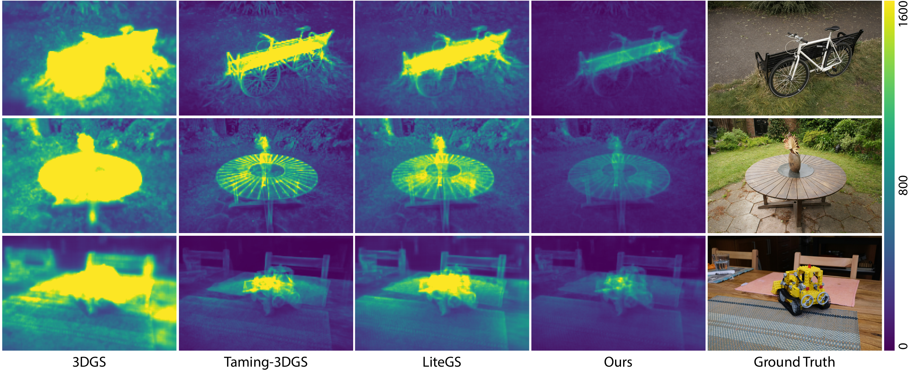
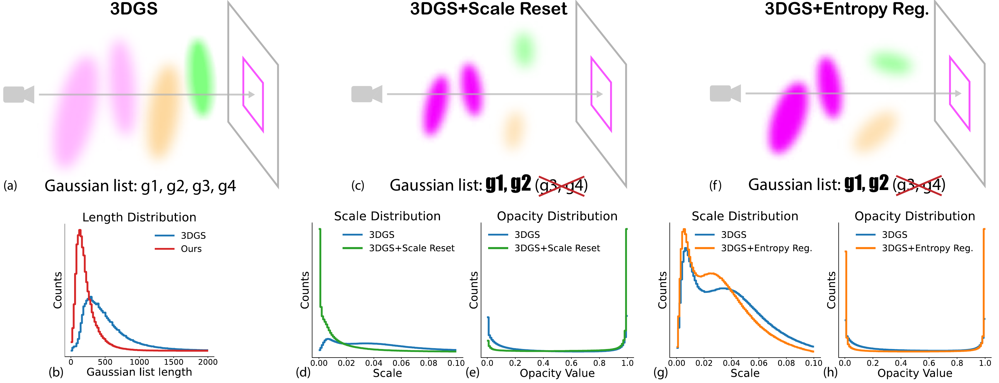
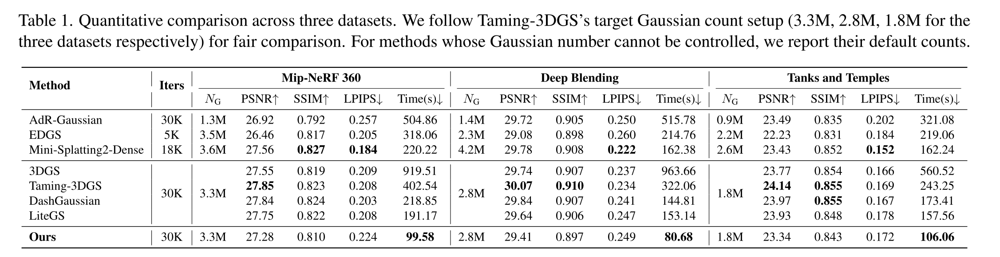

<h1 align="center">Speeding Up the Learning of 3D Gaussians with Much Shorter Gaussian Lists</h1>

<p align="center"><b>CVPR 2026</b></p>

<p align="center">
  <a href="https://tail-3lbs.github.io/">Jiaqi Liu</a> &nbsp;|&nbsp;
  <a href="https://h312h.github.io/">Zhizhong Han</a>
</p>

<p align="center">Machine Perception Lab, Wayne State University</p>

<p align="center">
  <a href="https://arxiv.org/abs/2603.09277">Paper (arXiv 2603.09277)</a> | <a href="https://machineperceptionlab.github.io/ShorterSplatting-Project/">Project Page</a>
</p>



## Table of Contents

- [Method Overview](#method-overview)
- [Results](#results)
- [Installation](#installation)
- [Dataset Preparation](#dataset-preparation)
- [Evaluation](#evaluation)
- [Code Changes](#code-changes)
- [Acknowledgements](#acknowledgements)
- [BibTeX](#bibtex)

## Method Overview



Overview of our method and effects. (a) The Gaussian list of 3DGS. (b) Distribution of Gaussian list length showing our method produces significantly shorter lists. (c) Gaussian list reduction after applying scale reset. (d, e) Scale and opacity distributions comparing 3DGS and 3DGS with scale reset, showing scale reset produces smaller Gaussians with higher opacities. (f) Gaussian list reduction after applying entropy regularization. (g, h) Scale and opacity distributions comparing 3DGS and 3DGS with entropy regularization, demonstrating entropy constraint produces smaller Gaussians and more polarized opacities. "3DGS" results are produced with LiteGS.

## Results

Results are obtained on Ubuntu 24.04.2 LTS with an NVIDIA GeForce RTX 5090 D (32 GB VRAM), CUDA 12.8, Python 3.10.16, and PyTorch 2.8.0.



## Installation

This repo is built upon [LiteGS (stable branch)](https://github.com/MooreThreads/LiteGS/tree/stable). For installation, please follow the instructions in [3D Gaussian Splatting](https://github.com/graphdeco-inria/gaussian-splatting) and [LiteGS (stable)](https://github.com/MooreThreads/LiteGS/tree/stable). Prerequisites include a CUDA-capable GPU with the CUDA toolkit installed, and a conda environment with Python and PyTorch. After that, the submodules need to be compiled and installed.

```bash
git clone --recursive git@github.com:MachinePerceptionLab/ShorterSplatting.git
```

Then install the submodules:

```bash
cd litegs/submodules/fused_ssim && pip install . && cd -
cd litegs/submodules/simple-knn && pip install . && cd -
cd litegs/submodules/gaussian_raster && pip install . && cd -
cd litegs/submodules/lanczos-resampling && pip install . && cd -
```

## Dataset Preparation

We evaluate on [Mip-NeRF 360](https://jonbarron.info/mipnerf360/), [Tanks and Temples](https://www.tanksandtemples.org/), and [Deep Blending](https://github.com/Phog/DeepBlending). Please follow their official instructions to download and organize the data.

## Evaluation

To reproduce the paper's quantitative results:

```bash
python ./full_eval.py --save_images \
    --mipnerf360 /path/to/mipnerf360 \
    --tanksandtemples /path/to/tanksandtemples \
    --deepblending /path/to/deepblending \
    --enable_dash --lambda_entropy 0.015 --scale_reset_factor 0.2
```

Full evaluation with baseline LiteGS:

```bash
python ./full_eval.py --save_images \
    --mipnerf360 /path/to/mipnerf360 \
    --tanksandtemples /path/to/tanksandtemples \
    --deepblending /path/to/deepblending
```

Print and compare stats:

```bash
python litegs/spreading/misc/print_stats.py --no_training \
    output-m360-litegs \
    output-m360-litegs+dash+reset.0.2+entropy.0.015
```

```bash
python litegs/spreading/misc/print_stats.py --no_training \
    output-db-litegs \
    output-db-litegs+dash+reset.0.2+entropy.0.015
```

```bash
python litegs/spreading/misc/print_stats.py --no_training \
    output-tat-litegs \
    output-tat-litegs+dash+reset.0.2+entropy.0.015
```

## Code Changes

This code is built upon [LiteGS (stable branch)](https://github.com/MooreThreads/LiteGS/tree/stable). To see the changes made on top of LiteGS stable, run:

```bash
git diff --compact-summary litegs_stable HEAD -- . ':(exclude)*lanczos*' ':(exclude).vscode' ':(exclude)assets' ':(exclude)doc_img'
```

Key changes include:

1. Scale reset — scheduling policy and reset operation
2. Entropy regularization — scheduling policy, loss term, and custom CUDA backward pass
3. DashGaussian integration — incorporating DashGaussian

## Acknowledgements

This project was partially supported by an NVIDIA academic award and a Richard Barber research award.

We sincerely thank the authors of [LiteGS](https://github.com/MooreThreads/LiteGS), [DashGaussian](https://github.com/YouyuChen0207/DashGaussian), and [3D Gaussian Splatting](https://github.com/graphdeco-inria/gaussian-splatting) for their excellent open-source work, which forms the foundation of this project.

## BibTeX

```bibtex
@InProceedings{Liu2026shortersplatting,
  title     = {Speeding Up the Learning of 3D Gaussians with Much Shorter Gaussian Lists},
  author    = {Liu, Jiaqi and Han, Zhizhong},
  booktitle = {Proceedings of the IEEE/CVF Conference on Computer Vision and Pattern Recognition},
  year      = {2026}
}
```

## Update History

- **2026-03-18**: First release.
